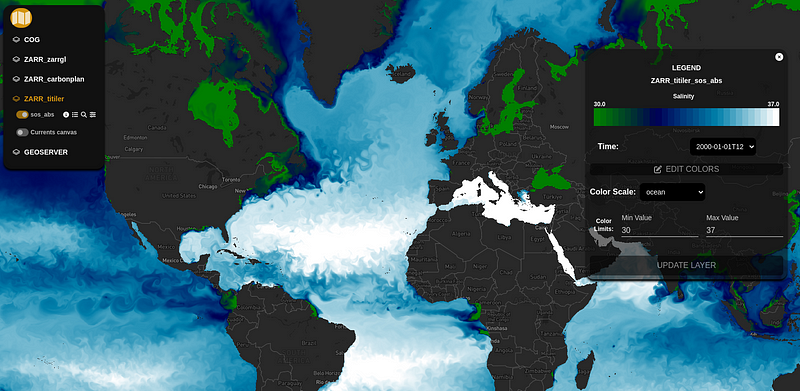

# Zarr Visualization in the Browser

**Live demo:** [https://noc-oi.github.io/zarr-vis](https://noc-oi.github.io/zarr-vis)

**Article:** [Zarr in the Browser — Fast, Flexible, and Surprisingly Powerful for Big Geo Data](https://medium.com/@tobias.ramalho.ferreira/zarr-in-the-browser-fast-flexible-and-surprisingly-powerful-for-big-geo-data-eeb90ddf8a3d)

## Overview

This project explores fast, scalable methods for visualizing **Zarr-based multidimensional data** directly in the browser. It evaluates server-side and client-side strategies and demonstrates them in a **Next.js application** built for interactivity and performance.

Zarr is a powerful format for storing chunked, compressed N-dimensional arrays, widely used in climate and oceanography. However, visualizing Zarr efficiently on the web has remained a challenge. This project implements and compares multiple approaches:

- Server-side dynamic tile rendering with [**titiler-multidim**](https://github.com/developmentseed/titiler)
- Pure browser-side rendering using **WebGL + Mapbox**, inspired by [**carbonplan/maps**](https://github.com/carbonplan/maps)
- Pure browser-side rendering using **WebGL + Mapbox**, using [**zarr-gl**](https://github.com/carderne/zarr-gl)
- Optional rendering using Cloud-Optimized GeoTIFFs (COGs) and legacy WMS/WMTS tools like GeoServer

## Features

- Visualizes 10GB+ datasets interactively with smooth zoom/pan
- Supports time and depth slicing for 4D datasets
- Dynamically applies colormaps and enables pixel-level inspection
- Deploys in either static or server-backed modes
- Uses Zarr v2 with multiscale pyramids and consolidated metadata
- Generate canvas layers for animated visualizations (e.g., ocean currents)

## Datasets

The demo uses example outputs from the [**Near Present Day (NPD) NEMO ocean model**](https://github.com/NOC-MSM/NOC_Near_Present_Day) produced by the [National Oceanography Centre (NOC)](https://www.noc.ac.uk). These datasets are in Zarr format with curvilinear grids and multiple timesteps.

For full details on the preprocessing steps, including reprojection, rechunking, and pyramid generation, see the [Medium article](https://medium.com/@tobias.ramalho.ferreira/zarr-in-the-browser-fast-flexible-and-surprisingly-powerful-for-big-geo-data-eeb90ddf8a3d).

## Getting Started

### 1. Clone the repo

```bash
git clone https://github.com/NOC-OI/zarr-vis.git
cd zarr-vis
```

### 2. Install dependencies

```bash
npm install
```

### 3. Start the development server

```bash
npm run dev
```

Open [http://localhost:3000](http://localhost:3000) in your browser.

### 4. (OPTIONAL) Add your own layers

To add your own layers, modify the `src/application/data/layers-json.tsx` file. You can add Zarr datasets or other compatible layers by following the existing format.

## Architecture

### Server-Side Tiling (Recommended for large datasets)

- Uses [**titiler-multidim**](https://github.com/developmentseed/titiler) to dynamically generate tiles
- Deployed with FastAPI and auto-scaled via Knative (Kubernetes on JASMIN)
- Optional Redis caching layer for low-latency access

### Pure Client-Side (Static deployment)

- Streams Zarr tiles directly into WebGL via custom `<CarbonplanLayer>` for Mapbox GL JS
- Streams Zarr tiles directly into WebGL via `Zarr-gl` layer for Mapbox GL JS
- Uses multiscale pyramids built with [`ndpyramid`](https://github.com/carbonplan/ndpyramid)
- No server required — ideal for GitHub Pages or CDN deployment

### Baseline references

- GeoServer with NetCDF support was deployed in Kubernetes: Legacy Comparison
- Cloud Optimized GeoTIFFs (COGs) - converted the dataset to COG files, generating one COG per timestep and depth level.

## Data Preparation (Optional Workflow)

> Tools: `xarray`, `iris`, `ndpyramid`, `rasterio`, `xESMF`

1. Reproject to EPSG:4326 or EPSG:3857
2. Optimize chunking for web (e.g., `256x256` spatial-only chunks)
3. Build multiscale pyramids using `ndpyramid`
4. Save in Zarr v2 with `.zmetadata` consolidated
5. Optionally export to NetCDF or COG for legacy tools

For Python snippets and examples, see the [article](https://medium.com/...).

## 📸 Screenshots



> Visualizing a 10GB dataset in the browser using a dynamic backend tile server. As you can see, you can easily change the timestamp, colormap, and map scale.


> Example of visualizing a 10GB dataset in the browser using a carbonplan/maps adapted code. As you can see, you can easily change the timestamp, colormap, and map scale


> Accessing Zarr data using the tile server and converting it into a canvas layer to represent the animated current fields on a map. You can interact with the dimensions of the data (time and depth).

## Related Tools

- [Titiler-Multidim](https://github.com/developmentseed/titiler)
- [Carbonplan Maps](https://github.com/carbonplan/maps)
- [zarr-gl](https://github.com/carderne/zarr-gl)
- [ndpyramid](https://github.com/carbonplan/ndpyramid)
- [windjs-over-mapbox](https://github.com/bumbeishvili/windjs-over-mapbox)
- [js-colormaps](https://github.com/timothygebhard/js-colormaps)

## Acknowledgements

This work is part of the [Atlantis project](https://atlantis.ac.uk/), a UK initiative supporting long-term ocean observations and marine science in the Atlantic. This project is led by the [National Oceanography Centre (NOC)](https://noc.ac.uk/).
